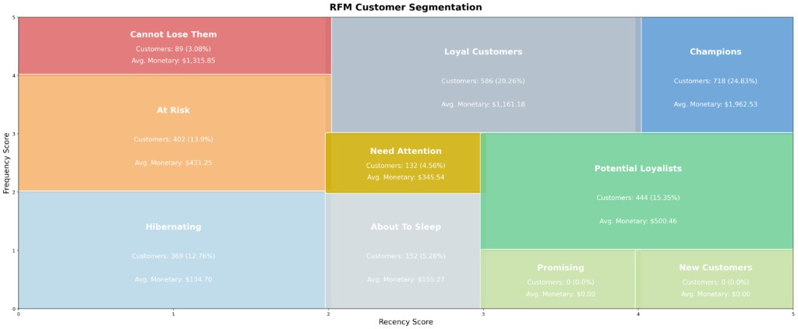
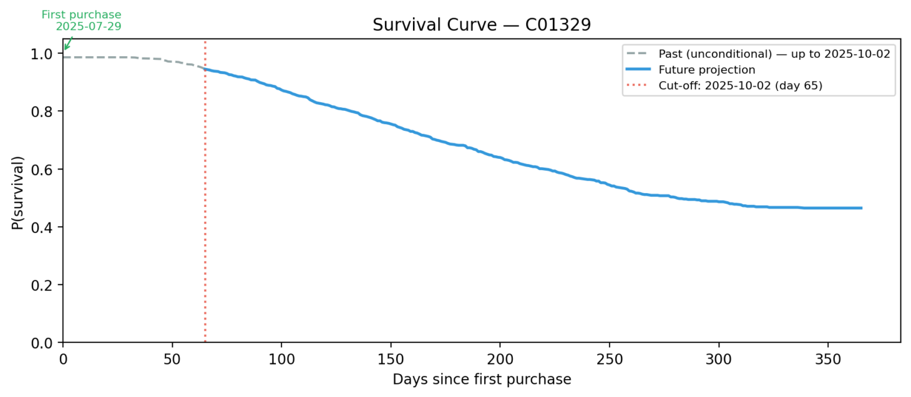
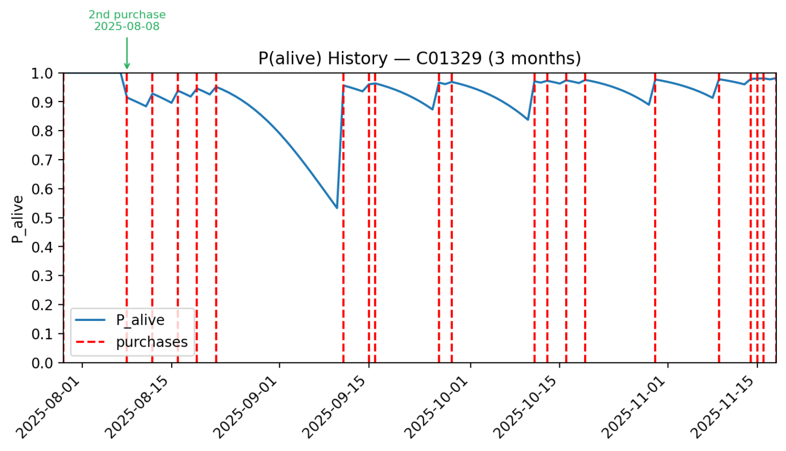
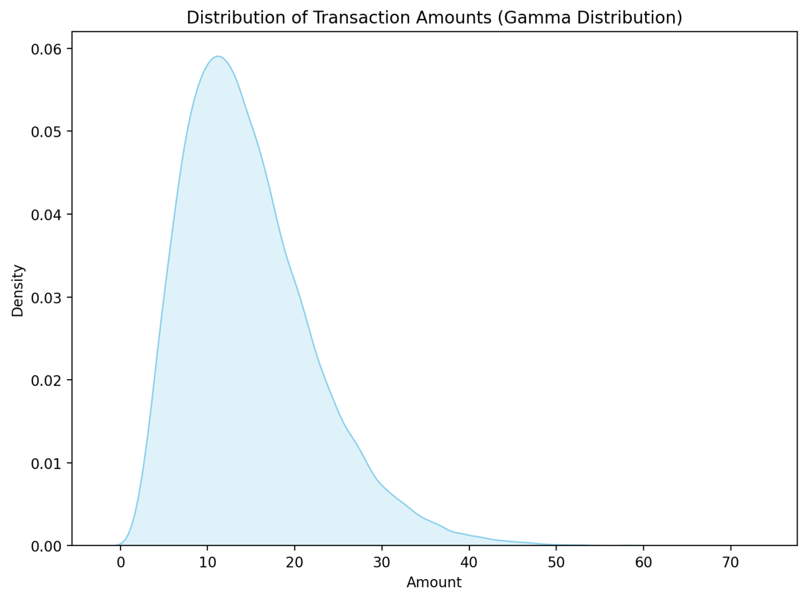

# Customer Growth & Retention — Production System

End-to-end customer analytics platform combining churn classification (LightGBM),
BG/NBD + Gamma-Gamma CLV modelling, and CoxPH survival analysis.

---

## Data

Raw inputs live under `data/` as CSV files loaded by `core/data.py`:

- **`transactions.csv`**: one purchase per row with `customer_id`, `transaction_date`, and `amount` (transaction value). Dates are parsed as timestamps; loaders assert no missing dates or amounts.
- **`customers.csv`**: one customer per row with `customer_id`, `signup_date`, and `true_lifetime_days` (ground-truth total lifetime in days).

Together these tables support RFM and transaction-history features, probabilistic churn, repeat-purchase BG/NBD and Gamma-Gamma valuation, and CoxPH survival modelling.

---

## Project Structure

```
survival_analysis/
├── data/                   # Raw CSVs (transactions.csv, customers.csv)
├── artifacts/              # Trained model files and pre-computed scores
├── core/
│   ├── config.py           # Centralised constants and artifact paths
│   ├── data.py             # Data loading utilities
│   ├── features.py         # Feature engineering (RFM, churn, survival)
│   ├── scoring.py          # Scoring functions (individual + batch)
│   └── charts.py           # Matplotlib chart helpers
├── api/
│   ├── main.py             # FastAPI app entry point
│   ├── schemas.py          # Pydantic request/response models
│   └── routers/            # Endpoints: score, churn, survival, clv, retention
├── app/
│   └── streamlit_app.py    # Streamlit dashboard
├── train.py                # One-time training script
├── explore_data.ipynb      # Reference notebook (read-only)
└── requirements.txt
```

---

## Quickstart

### 1. Create and activate a virtual environment

```bash
python3 -m venv venv
source venv/bin/activate
```

### 2. Install dependencies

```bash
pip install -r requirements.txt
```

### 3. Train models

Trains all models (LightGBM, BG/NBD, Gamma-Gamma, CoxPH) and saves artifacts
to `artifacts/`, including pre-computed batch scores.

```bash
python train.py
```

### 4. Run the Streamlit dashboard

```bash
streamlit run app/streamlit_app.py
```

Opens at [http://localhost:8501](http://localhost:8501)

### 5. Run the FastAPI (optional)

```bash
uvicorn api.main:app --reload --port 8000
```

Interactive docs at [http://localhost:8000/docs](http://localhost:8000/docs)

---

## Streamlit Dashboard Pages

| Page | Description |
|---|---|
| **Transactions** | Browse all transactions with filters by customer ID, date range, and amount |
| **RFM Analysis** | Recency × Frequency score grid (0–5 axes) with named segments, customer counts, % of base, and average monetary value — see figure below. |
| **Customer Lookup** | Individual risk profile: churn probability, P(alive) over time (BG/NBD), CoxPH survival curve, CLV/NPV — see figures below. |
| **Model Performance** | Confusion matrix, SHAP plots, **Gamma-Gamma** transaction-amount distribution (see figure), Cox sample survival curves |
| **Retention Ranking** | Two shortlist strategies — **RFM segments** vs **model-based priority** (see below) |

The **RFM Analysis** page shows customers on a Recency × Frequency grid, with segment labels, customer counts, base share, and average spend for each cell to highlight valuable and at-risk cohorts.

<p align="center">
  
</p>

The **Customer Lookup** page plots a **CoxPH survival curve** for the selected customer: **past** behavior (from first purchase up to the training cutoff) and a **forward** projection on the same time scale.

<p align="center">
  
</p>

The same page shows **P(alive)** from the **BG/NBD** model as a **history** chart (`lifetimes` `plot_history_alive`): probability the customer is still active after each purchase, with purchase dates on the timeline. Drops reflect time since the last order without a repeat; spikes occur when another purchase is observed.

<p align="center">
  
</p>

**Model Performance → Gamma-Gamma** plots the **fitted spend model**: a **density curve** of amounts simulated from the Gamma-Gamma parameters, i.e. the implied distribution of order values (right-skewed mass at lower amounts, long tail of larger tickets).

<p align="center">
  
</p>

**Retention Ranking Page:**

**RFM:** browse three segments (Champions, Cannot Lose Them, Need Attention); churn-highest first when batch scores exist. 

**High CLV high churn:** one ranked list from Cox short-term dropout risk × scaled BG/NBD CLV.

---

## FastAPI

The app loads trained artifacts and `transactions.csv` once at startup (`api/main`). All scoring routes are **POST** with JSON bodies; OpenAPI request/response shapes live at [http://localhost:8000/docs](http://localhost:8000/docs) when the server is running.

| Route | Purpose |
|---|---|
| `POST /score_customer` | One call: churn probability/label, P(alive), BG/NBD CLV, Cox expected remaining lifetime, survival-weighted CLV (NPV); returns embedded scoring assumptions. |
| `POST /predict_churn` | LightGBM churn probability and risk band for a customer. |
| `POST /predict_survival` | CoxPH-based survival summary (e.g. expected remaining lifetime) at the training cutoff. |
| `POST /estimate_clv` | CLV by method: `bgnbd` (Gamma-Gamma + BG/NBD) or `survival` (Cox-weighted cashflow NPV via `get_payback_df`). |
| `POST /rank_customers_for_retention` | Ranks customers using pre-computed `artifacts/scores_df.pkl` (run `train.py` first); strategy `high_clv_high_churn` combines Cox dropout risk over a horizon with min–max normalized BG/NBD CLV. |
